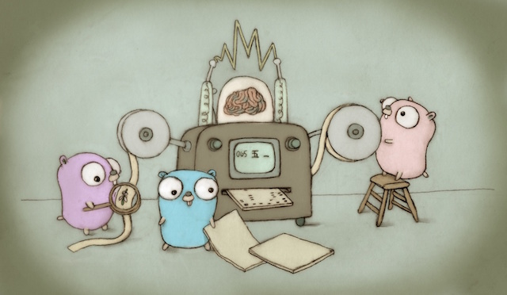

class: center, middle

# Intro to Go

[github.com/jharlap/go-101](https://github.com/jharlap/go-101)

---

# Go

Go is a general purpose language designed for systems programming.

- Strongly typed
- Garbage collected
- Explicit support for concurrency
- Compiler/linker produces executable binaries
- Simple grammar makes good tooling easy

---

# Topics

- Basics
- Object Oriented Go
- Concurrency

---

class: center, middle

# Basics

---

# Overview

[embedmd]:# (slides/basics_overview.go)

???

- All code must exist within a package
- Package main is special: must have func main
- Import other packages
- Function declaration syntax (func, name, arguments, results, block)
- Access symbols in imported packages

---

# Packages

- Packages must be within GOPATH
- `$GOPATH/src/package`
- Import path defined by directory structure
- Fetch packages with `go get`
- All files in a package directory are part of the **same** package

`go get -u github.com/jharlap/go-101`

`$GOPATH/src/github.com/jharlap/go-101` now exists

`import github.com/bradfitz/iter`

Tip: Name packages `[a-z][a-z0-9_-]` for best results


???

- Packages stored in GOPATH/src/...
- No reserved words, must start with letter
- Spec pretends unicode OK - don't do it
- Can split code into multiple files - symbols are visible across files

---

# Primitive Types

- bool (true/false)
- int (int8, int16, int32, int64)
- uint (uint8, uint16, uint32, uint64)
- float32 float64
- byte (uint8)
- rune (int32)
- string (_immutable_ sequence of bytes)

???

- Strongly and statically typed
- Compiler can infer types

---

# Variables

```go
wattpadURL := "https://www.wattpad.com/" // capitalize acronyms
var isGreen bool
var answer = 42 // compiler inferred type int

var (
	a int
	b bool = true
)
```

???

- Short declaration with `:=`
- Long declaraction with var
- Type can be inferred from value at compile time
- Declare multiple variables together

---

# Zero Values

Declared but un-initialized variables hold zero value of type:

[embedmd]:# (slides/basics_zeros.go /var/ /""/)

???

Yes, complex64 is a type.

---

# Structs

A struct is a sequence of fields with names and types.

[embedmd]:# (slides/basics_struct.go /\ttype/ /}/)
???

- `type` keyword names a user-defined type
- `struct` keyword plus field declaration block is the complete type
--
[embedmd]:# (slides/basics_struct.go /\tp :=/ /\d\)/)

???

Zero value for a struct type is a value of that struct where all fields hold the zero value for the field type.

---

# Pointers

[embedmd]:# (slides/basics_pointers.go /func/ /e\n}/)


???

- `*int` type denoting pointer to variable of type `int`
- `&x` address operator generates pointer of type `*int` to `x` 
- `*y` pointer indirection
- `func byValue` takes an integer value
- `func byReference` takes an integer pointer
- zero value is nil
- `&` to get a pointer to a value
- `*` to deference the pointer

---

# Slices

```go
var s []byte   // byte slice
s2 := make([]byte, 1024) // byte slice with 1024 elements (all zeros)
s3 := []int{6, 9, 42} // declare and initialize with some values

s2[0] = 42
s2[4000] = 28 // index out of bounds will panic
s = append(s, 42) // magically grow backing array (new allocation and copy values)

len(s) // length = 1
cap(s) // capacity = ... something at least equal to 1
```

- Array is a numbered sequence of elements of a single type
- Slice describes a dynamically growing numbered sequence of elements (actually backed by an array)

???

- Arrays are fixed size
- Slices grow automatically
- Both are zero-indexed
- `make` to create non-nil slices
- `append` function to add items to a slice and grow magically

---

# Maps

```go
m := make(map[string]int)
m["answer"] = 42

a := m["answer"]   // a = 42
q := m["question"] // q = 0 (zero value of type int)

q, ok := m["question"] // q = 0, ok = false

m2 := map[string]int{
	"one": 1,
	"two": 2,
}
```

???

- `make` allocates a map
- element access/mutation looks like slice/array element access
- one-valued element access returns zero value for missing values
- two-valued element access exposes whether element exists or not
- map "literal"

---

# Zero Values, part 2

[embedmd]:# (slides/basics_zeros.go /var/ $)

???

- nil for pointer, slice, func, map, channel
- struct is a value with all fields initialized to the zero value of the field types
- array is an array of size n containing n zero values

---

# Loops

[embedmd]:# (slides/basics_loops.go /\t.. for/ /--\n\t}/)

???

# for/range

- slice one-valued return = index
- slice two-valued return = index, value
- map one-valued return = key
- map two-valued return = key, value

# for init/cond/post

- like C

# for cond

- while loop

---

# Functions

[embedmd]:# (slides/basics_functions.go /func main/ /6/)
[embedmd]:# (slides/basics_functions.go /\n.. sum/ /return r\n}/)

???

- `func` keyword, name, parameters, results, block
- doc "block"

---

# Functions (more)

[embedmd]:# (slides/basics_functions.go /func main/ /\n}/)
[embedmd]:# (slides/basics_functions.go /\n.. Query/ $)

???

- multi-valued return
- defer runs after the return is evaluated but before the function exits, in reverse order (FILO)

---

# Function Values

[embedmd]:# (slides/basics_function_values.go /func main/ $)

???

- functions are values
- type of `handler` is `func(http.ResponseWriter, *http.Request)`
- handler closed over the addr variable defined in a surrounding scope

---
class: inverse

# Exercise 1

- Declare a struct type to contain information about a person
- Include a name and age
- Declare a function that pretty-prints values of your type
- Create a slice of people
- In `main` call your pretty-printer for each person

Remember every program has one `main` package and each package must be in its own directory in your `$GOPATH`!

```bash
mkdir -p $GOPATH/src/github.com/MYUSERNAME/exercises/ex1
cd $GOPATH/src/github.com/MYUSERNAME/exercises/ex1
cp $GOPATH/src/github.com/jharlap/go-101/exercises/ex1/template/main.go ./

# fill in the program

go run main.go
```

---

[embedmd]:# (exercises/ex1/solution/main.go)

---

# So far we covered

- Packages
- Built-in types
- Variables
- Zero values
- Structs, slices, maps
- Loops
- Functions

---

class: center, middle

# Object Oriented Go

---

# Is Go Object Oriented?

OOL has classes, objects, encapsulation, inheritance, composition, polymorphism. Is Go an OOL? No.

But...

--

An object is something with both state and behaviour.

User defined types can have methods, so we have objects.

???

Object has state and behaviour. State = data = type/struct. Behaviour = methods.

---

# Other OOP Properties

- Encapsulation is about visibility
???
Go has package-level visibility

--

- Composition describes the **has-a** relation between objects
???
Struct fields can have user-defined types (which can have methods)

--

- Inheritance describes the **is-a** relation between objects
???
Embedding _kinda sorta_ mimicks inheritance...

--

- Polymorphism: Implicitly satisfied interfaces are THE BEST!

---

# Methods

[embedmd]:# (slides/oop_methods.go /.. Count/ /}/)
???

- Count is a user-defined type
- Mutex will let us make this thread-safe (maybe not the best way)
--

[embedmd]:# (slides/oop_methods.go /.. Increment/ /}/)

???

- Method signature: func, receiver, method name, parameters, return types, code block
- Receiver is effectively a parameter for the function
- Receiver variable name usually 1 char
- Method mutates the object so must be a pointer
--

[embedmd]:# (slides/oop_methods.go /func main/ /}/)

???

- Method invocation with dot syntax
- This example doesn't show concurrent use of Count... stay tuned

---

class: inverse

# Exercise 2

- `fmt.Println` uses the `fmt.Stringer` interface
- Any object that implements `Stringer` will be pretty printed
- Update your `Person` so that it implements `fmt.Stringer`

Tip: Use godoc.org to look up the Stringer interface

???

https://godoc.org/fmt#Stringer: `String() string`

---

[embedmd]:# (exercises/ex2/solution/main.go)

---

# Composition (has-a)

[embedmd]:# (slides/oop_composition.go /type/ $)

???

- User **has-a** Person
- String method accesses `u.Person.Name`

---

# Embedding (is-a)

[embedmd]:# (slides/oop_embedding.go /type/ $)

???

- User **is-a** Person
- Embedded struct properties promoted to embedding struct
- Person seems anonymous, actually still accessible using type name
- No short form to declare struct literal with embedded type

---

# Embedding, part 2

[embedmd]:# (slides/oop_embedding_mutex.go /.. Count/ /}/)
???

- Embedding `sync.Mutex` means `Count` **is-a** `Mutex`
- Can call methods on embedded types
--

[embedmd]:# (slides/oop_embedding_mutex.go /.. Increment/ /}/)

???

- Note `Lock` is promoted automatically so can be invoked on the `*Count` directly
- Not quite the same as C++/Java/... - see [Tony's example](https://play.golang.org/p/_q-tEdZDMG): Method on a specific type, not an interface.


---

# Visibility

```go
package http // import net/http

type Client struct { /* ... */ }

func (c *Client) send(/* ... */) {}

func (c *Client) Get(url string) (resp *Response, err error) {}
```

???

- stdlib HTTP client - capital C = exported/visible
- send method starts with lowercase, so not visible outside net/http
- Get method exported
--

_**Design your package API deliberately**_

---

# Interfaces

Interface is a type specification that describes _only_ behaviour

```go
package io

type Reader interface {
	Read(p []byte) (n int, err error)
}

type Closer interface {
	Close() error
}
```

???

Idiomatic Go:
- small interfaces (1 method VERY common)
- name interface `method`-er if only 1 method
--

```go
type Buffer struct {
	buf []byte
	off int
}

func (b *Buffer) Read(p []byte) (n int, err error) {
	if b.off >= len(b.buf) {
		return 0, io.EOF
	}
	n = copy(p, b.buf[b.off:])
	b.off += n
	return // named return params
}
```

???

- Buffer _implicitly_ implements Reader

---

# Interfaces

```go
package ioutil

func ReadAll(r io.Reader) ([]byte, error) { /* ... */ }
```

```go
package main

import "io/ioutil"

func process(r io.Reader) {
	b, err := ioutil.ReadAll(r)
	// do something with the data
}

func main() {
	var buf *Buffer
	// ... somehow store data in buf

	// process accepts an io.Reader, but we pass it a *Buffer
	process(buf)
}
```

???

- Buffer implicitly implements io.Reader
- process accepts the interface type
- call it with anything that has the Read method
- used all over the place!

---

# inteface{}

 An interface is implemented by all objects that implement the specified methods.

 What is `interface{}`? What implements `interface{}`?

???

Empty interface specifies no methods, so any type satisfies it

---

class: inverse

# Exercise 3

- Copy the template `store` package
- Define an interface with a method `StoreKey()` that returns a `uint64`
- Create a type `InMemory` that uses a map to store any type of object that implements your interface
- `InMemory` should have functions to store and retrieve values by key
- Update your `Person` so that it implements the interface
- Try to name everything as fluently and idiomatically as possible

---

[embedmd]:# (exercises/ex3/solution/store/store.go)

---

[embedmd]:# (exercises/ex3/solution/main.go /package.*/)

...

[embedmd]:# (exercises/ex3/solution/main.go /func.*StoreKey/ $)

---

# Composition with Interfaces

```go
package io

type Reader interface {
        Read(p []byte) (n int, err error)
}

type Closer interface {
        Close() error
}

type ReadCloser interface {
        Reader
        Closer
}
```

Idiomatic Go: compose interfaces to create complex behaviours from small reusable building blocks

???

Embedding isn't just for structs! Interfaces embedded in an interface.

`io.ReadCloser` implemented by `os.File`, `net.Conn`, `http.Request.Body`, and many more!

---

# OOP Recap

- Methods
- Embedding
- Visibility
- Interfaces
- Composition

---

class: center, middle

# Concurrency

---

# Concurrency

Concurrency is not parallelism!

Go concurrency primitives:

- goroutines for concurrent execution
- channels for communicating between goroutines

???

https://blog.golang.org/concurrency-is-not-parallelism

---

# Goroutines

- Lightweight threads
- Go runtime multiplexes goroutines onto OS threads and schedules execution
- ~2KB RAM per goroutine

---

# Goroutines

[embedmd]:# (slides/concurrency_goroutines_serial.go /func/ $)

```bash
$ time go run concurrency_goroutines_serial.go
1 2 3 4 5
go run concurrency_goroutines_serial.go  0.34s user 0.07s system 2.848 total
```

???

Note the runtime of 2.8 seconds: 5 sleeps of 0.5 seconds

---

# Goroutines

[embedmd]:# (slides/concurrency_goroutines_concurrent.go /func/ $)

???

Predict the output?

--

```bash
$ time go run concurrency_goroutines_concurrent.go

go run concurrency_goroutines_concurrent.go  0.33s user 0.09s system 0.430 total
```

???

- `go myfunc()` does not block
- 5 goroutines scheduled, all start sleeping, main func finishes and program exits
- runtime of 0.4 seconds

---

# Goroutines

[embedmd]:# (slides/concurrency_goroutines_concurrent_wg.go /func/ $)

```bash
$ time go run concurrency_goroutines_concurrent_wg.go
4 3 2 1 5
go run concurrency_goroutines_concurrent_wg.go  0.33s user 0.06s system 0.831 total
```

???

- no guarantee of goroutine ordering
- runtime 0.8 seconds
- waitgroup `Done()` modifies object, so must pass pointer to function

---

# Goroutines

[embedmd]:# (slides/concurrency_goroutines_http.go)

- stdlib net/http.Server starts a goroutine per request
- NB: program will run until interrupted or it crashes

---

class: inverse

# Exercise 4

- Update your program to concurrently create several people and store them in the store
- Initialize 5 different people
- Create an InMemory store
- Concurrently store each of them, printing the person in the goroutine
- Run your program a few times to see what happens to the output order

???

If your store is not thread safe, what happened? Go detects data races on maps.

---

[embedmd]:# (exercises/ex4/solution/store/store.go /.. An InMemory/ $)

???

- sync package contains synchronization primitives including mutual exclusion locks and wait groups
- defer Unlock ensures lock is eventually unlocked and keeps unlocking code close to locking code for increased readability

---

[embedmd]:# (exercises/ex4/solution/main.go /package.*/)

...

[embedmd]:# (exercises/ex4/solution/main.go /func.*StoreKey/ $)

???

wg.Add must be called before scheduling the goroutine or execution will be non-deterministic

---

class: middle, center

### Do not communicate by sharing memory; instead, share memory by communicating. [_Effective Go_](https://golang.org/doc/effective_go.html)

???

Concurrent functions that need to coordinate/interact can share memory (access common variables) or communicate by sending messages.

We already saw sharing memory: the shared in-memory database accessed by all goroutines.

---

# Channels

```go
ch := make(chan int)
ch <- 42  // send a value to the channel
v := <-ch // receive a value from the channel
```

Receive operator blocks until a value is available or the channel is closed. If the channel is closed, the value received will be the zero value for the channel type.
???

- `make` to create a channel
- zero value is nil
- arrows to send and receive

--

```go
v, ok := <-ch
```

ok bool: true if value received, false if channel is closed and empty

---

# Buffered Channels

```go
unbuffered := make(chan int)
unbuffered = make(chan int, 0) // equivalent to omitting size

buffered := make(chan int, 10)
```

Send operator blocks until the send can proceed by either:
- A receive operation
- The message being buffered in the channel

Send on a closed channel will panic.

???

- Sending can block regardless of buffered/unbuffered
- Buffers increase memory consumption
- Only buffer with a _deliberate reason_
- Buffer sizes should be deliberate, not arbitrary: set to the number of expected values
- Use unbuffered by default

---

# for range

```go
ch := make(chan int)
var wg sync.WaitGroup
go func() {
	for v := range ch {
		// use the value
	}
	wg.Done()
}()

ch <- 6
ch <- 9
ch <- 42
close(ch) // closes the channel - additional sends will panic
wg.Wait()
```

???

- for/range loops receiving from a channel until it is closed and empty
- easy way to implement task fanout to a pool of workers
- note the `wg.Done()` will only execute once the channel is close AND all messages consumed

---

# select

`select` is like `switch` but cases are channel operations

```go
jobs := make(chan Job)
heartbeat := make(chan struct{})

go func() {
	for {
		select {
		case j := <-jobs:
			process(j)

		case heartbeat<-struct{}{}:
			// no-op
		}
	}
}()
```

???

- heartbeat uses `chan struct{}` which is specially optimized in Go for signaling channels
- create a value of type `struct{}` with `struct{}{}`
- worker processes jobs and sends heartbeats when a heartbeat receiver is available
- all cases are checked and a **random** non-blocking case is selected for execution

---

# Signal Broadcast

Receive operator blocks until a value is available **or the channel is closed**.

Commonly used to broadcast a signal, such as a "quit" signal. 

```go
quit := make(chan struct{})
digits := make(chan int)

// real world: start a few of these goroutines
go func() {
	for {
		select {
		case <-quit:
			return
		case digits <- nextDigitOfPi():
		}
	}
}()

// receive and use digits until the user is satisfied

close(quit)
```

???

- digits will be sent until quit is closed

---

class: inverse

# Exercise 5

Change your main program:
- Write a function that receives `Person`s from a channel, stores them in the db, and sends the DB key to a next channel
- Write a function that receives DB keys from a channel, fetches the item from the DB, and prints the item along with the worker number
- Change your main function to start two storer goroutines and three fetcher goroutines, wired together as a pipeline
- Send at least 5 people into the pipeline so that they will each be stored then fetched

---

[embedmd]:# (exercises/ex5/solution/main.go /func storeWorker/ /}\n\t}\n}/)

--

[embedmd]:# (exercises/ex5/solution/main.go /.*ppl :=/ /close.*/)

???

- `<-chan Person` and `chan<- uint64` improve clarity of function semantics. compiler will complain if programmer violates stated contract

---

[embedmd]:# (exercises/ex5/solution/main.go /func main/ $)

---

# What we learned

- Goroutines
- Channels

---

class: center, middle

# Errors

---

# Errors

"Errors are values"

https://blog.golang.org/errors-are-values

???

"Errors are values" means:

- Not a special language construct
- Think of exceptions as GOTOs - all the arguments against GOTOs apply equally!
- Program on errors as you would any other value


--

```go
type error interface {
	Error() string
}
```

Zero value: nil

???

error is a predefined type which is an interface, so the zero value is nil

--

Idiomatic Go: two-valued return (T, error)

???

Re 2-valued return:

- 3-valued return: be suspicious 
- 4-valued probably a code smell: revisit your design

---

class: inverse

# Exercise 6

- Change your store API to randomly return errors
- Update your main program to handle the errors

Tip: [math/rand](https://godoc.org/math/rand) package may be helpful

???

Bonus exercise: Turn your program into a RESTful HTTP server (see `net/http`) and/or write unit tests for your program (see `testing`)

---

[embedmd]:# (exercises/ex6/solution/store/store.go /var err/ $)

---

[embedmd]:# (exercises/ex6/solution/main.go /func storeWorker/ /}\n\t}\n}/)

---

[embedmd]:# (exercises/ex6/solution/main.go /.*Output/ $)

---

# Errors

- Don't discard errors, handle them!
- Handle each error once

???

Handling an error can mean logging it, passing it up the call stack, running a fallback code path, whatever.

---

# Learning Resources

- [Effective Go](https://golang.org/doc/effective_go.html)
- [Go Language Spec](https://golang.org/ref/spec)
- Standard library (browse through godoc)
- [Gopher Slack](https://invite.slack.golangbridge.org/)
- [Go Best Practices](https://peter.bourgon.org/go-best-practices-2016/)
- [Gopher Academy](https://blog.gopheracademy.com/)
- [GoTime Podcast](http://gotime.fm/)
- [Go by Example](https://gobyexample.com/)
- [Many more learning resources from the Go wiki](https://github.com/golang/go/wiki#learning-more-about-go)

---

class: middle, center

# 🎉



(Please fill out the feedback survey!)

